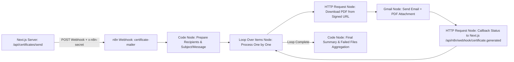

# 🎓 n8n Smart Certificate Mailer Automation Workflow Guide

This document outlines the complete setup for automating folder-based certificate dispatch via **n8n** in the **AI Event Organiser Platform**.

---

## 🏗️ Workflow Architecture



---

## ⚙️ 1. Environment Configuration (`.env.local`)

```env
APP_URL="http://localhost:3000"
NEXT_PUBLIC_APP_URL="http://localhost:3000"
N8N_CERTIFICATE_WEBHOOK="https://pradeepsekar.app.n8n.cloud/webhook/certificate-mailer"
N8N_WEBHOOK_SECRET="certificate_secret_2026"
```

---

## 🛠️ 2. Node Configuration Details

### Node 1: Webhook Trigger
- **Path**: `certificate-mailer`
- **Method**: `POST`
- **Authentication**: Header Auth (`x-n8n-secret`)

### Node 2: Prepare Recipients (Code Node)
Formats dynamic template variables (`{{name}}`, `{{event_name}}`) in the email subject and body message for each recipient.

### Node 3: Loop Over Items
Iterates through the recipients array one by one to ensure isolated error handling per email without interrupting the whole batch.

### Node 4: Download Certificate PDF (HTTP Request)
- **URL**: `={{ $json.fileUrl }}`
- **Response Format**: `File` (Binary)
- **On Error**: `Continue Regular Output` (Preserves workflow execution if download fails)

### Node 5: Gmail Send (Gmail Node)
- **Send To**: `={{ $json.email }}`
- **Subject**: `={{ $json.subject }}`
- **Message**: `={{ $json.message }}`
- **Attachment**: Binary Data (`data`)
- **On Error**: `Continue Regular Output`

### Node 6: Delivery Status Callback (HTTP Request)
- **URL**: `{{ $env.APP_URL }}/api/n8n/webhook/certificate.generated`
- **Headers**:
  - `Content-Type: application/json`
  - `x-n8n-secret: {{ $env.N8N_WEBHOOK_SECRET }}`
- **Body**:
  ```json
  {
    "campaignId": "={{ $json.campaignId }}",
    "eventId": "={{ $json.eventId }}",
    "recipientEmail": "={{ $json.email }}",
    "fileName": "={{ $json.fileName }}",
    "status": "SENT"
  }
  ```

---

## 📥 3. Ready-to-Import Workflow JSON

Import the workflow JSON located at [`docs/n8n-certificate-mailer.json`](file:///c:/Users/siva/Desktop/HACKGURU/AI/docs/n8n-certificate-mailer.json) directly into n8n.
